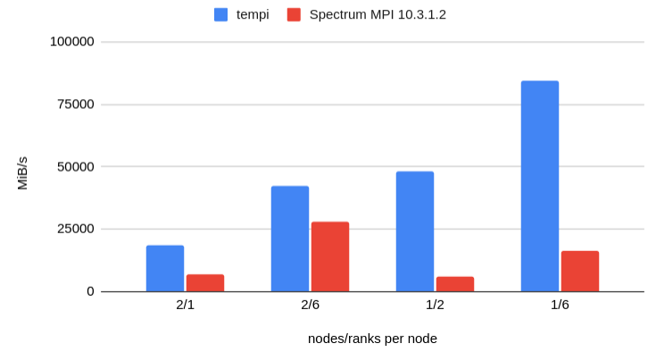
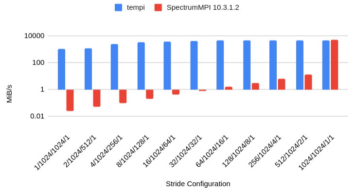

# TEMPI (Topology Experiments for MPI)

tem·pi */ˈtempē/*
- plural form of tempo: the rate of speed or motion of an activity

Experimental performance enhancmenets for CUDA+MPI codes.
Some improvements require no code modification, only linking the scampi library before your true MPI library.
Other improvements also require `#include tempi/mpi-ext.h` to utilize.

## MPI Derived Types

|Summit MPI_Pack|Summit MPI_Send|
|-|-|
|||

|deneb MPI_Pack|deneb MPI_Send|
|-|-|
|||

## MPI Communications

|Summit MPI_Alltoallv|Summit MPI_Send|
|-|-|
|||


## Quick Start

```
mkdir build
cd build
cmake ..
make
make test
```

Add the library to your link step before the underlying MPI library.

```
g++ ... -L/dir/containing/libtempi.so -l tempi <other link flags>
```

```cmake
add_subdirectory(tempi)
target_link_libraries(my-exe PRIVATE tempi::tempi)
target_link_libraries(my-exe PRIVATE ${MPI_CXX_LIBRARIES})
```

## Features

Performance fixes for CUDA+MPI code that requires no or minimal changes:
- [x] (OLCF Summit) Fast `MPI_Alltoallv` on basic data types (disable with `TEMPI_NO_ALLTOALLV`)
  - [ ] derived datatypes
- [x] (OLCF Summit) Small improvements to `MPI_Send` for large GPU-GPU messages.
- [x] Fast `MPI_Pack` on 3D strided data types (disable with `TEMPI_NO_PACK`)
- [x] Fast `MPI_Send` on 3D strided data types (disable with `TEMPI_NO_SEND`)
- [ ] Fast `MPI_Neighbor_alltoallv` on basic data types
  - [ ] derived datatypes

Performance improvements that require `mpi-ext.h`:
- [ ] coming soon...

## Design 

### MPI Implementation

Instead of using the MPI Profiling Interface (PMPI), our functions defer to the next symbol so this library can be chained with libraries that *do* use PMPI.

For example:

```c++
#include <mpi.h>
#include <dlfcn.h>

typedef int (*Func_MPI_Init)(int *argc, char ***argv);
Func_MPI_Init fn = nullptr;

extern "C" int MPI_Init(int *argc, char ***argv)
{
    if (!fn) {
        fn = reinterpret_cast<Func_MPI_Init>(dlsym(RTLD_NEXT, "MPI_Init"));
    }
    return fn(argc, argv);
}
```

instead of 

```c++
#include <mpi.h>

extern "C" int MPI_Init(int *argc, char ***argv)
{
    return PMPI_Init(argc, argv);
}
```

This library should come before any profiling library that uses PMPI in the linker order, otherwise the application will not call these implementations.
As we do not extend the MPI interface, there is no include files to add to your code.

### MPI derived datatype analysis (`src/internal/types.cpp`)

Different MPI derived datatypes can describe the same pattern of bytes to be `MPI_Pack`ed or `MPI_Send`ed.
TEMPI makes an effort to canonicalize those types in order to determine whether optimized GPU routines apply.

### Slab allocator  (`include/allocator_slab.hpp`)

Some optimizations require reorganizing data into temporary device buffers.
The size of those buffers is not known until runtime.
We use a primitive slab allocator to minimize the number of `cudaMalloc` or `cudaHostRegister`.

### Topology Discovery (`include/topology.hpp`)

Some optimizations rely on knowing which MPI ranks are on the same node.
This is discovered during `MPI_Init` and can be queried quickly during other MPI functions.

### CPU-CPU vs GPU-GPU performance

In certain scenarios, the CPU-CPU performance of MPI point-to-point communications is substantially faster than the GPU-GPU equivalent.
When that is the case, there is opportunity to accelerate the GPU-GPU communication.

## Knobs

The system can be controlled by environment variables.
These are the first thing read during `MPI_Init` (even if `TEMPI_DISABLE` is set, of course).
Setting the corresponding variable to any value (even empty) will change behavior.

|Environment Variable|Effect when Set|
|-|-|
|`TEMPI_DISABLE`|Disable all TEMPI behavior. All calls will use underlying library directly.|
|`TEMPI_NO_ALLTOALLV`|Use library `MPI_Alltoallv`|
|`TEMPI_NO_PACK`|Use library `MPI_Pack`|
|`TEMPI_NO_TYPE_COMMIT`|Use library `MPI_Type_commit`. Don't analyze MPI types for allowable optimizations.|

to unset an environment variable in bash: `unset <VAR>`

## OLCF Summit

`module unload darshan-runtime`

Summit wants to find MPI_Init in darshan (`jsrun -E LD_DEBUG=symbols`).

```
symbol=MPI_Init;  lookup in file=bin/bench-mpi-pack [0]
     68381:     symbol=MPI_Init;  lookup in file=/autofs/nccs-svm1_sw/summit/.swci/1-compute/opt/spack/20180914/linux-rhel7-ppc64le/gcc-4.8.5/darshan-runtime-3.1.7-cnvxicgf5j4ap64qi6v5gxp67hmrjz43/lib/libdarshan.so [0]
```

Darshan is not explicitly included in the link step when building, so somehow it is injected at runtime.
In any case, we can fix this by `module unload darshan-runtime`, so then our `MPI_Init` happens right after `libpami_cudahook.so`.
Later, the lazy lookup will cause it to happen in `libmpiprofilesupport.so.3` and then `libmpi_ibm.so.3`.

**other notes**

nsight-systems 2020.3.1.71 can crash with the osrt or mpi profiler turned on. Disable with `nsys profile -t cuda,nvtx`.

To control the compute mode, use bsub -alloc_flags gpudefault (see `olcf.ornl.gov/for-users/system-user-guides/summitdev-quickstart-guide/#gpu-specific-jobs`)

To enable GPUDirect, do `jsrun --smpiargs="-gpu" ...` (see docs.olcf.ornl.gov/systems/summit_user_guide.html, "CUDA-Aware MPI")

## Contributing

* Underlying MPI functions are declared in `include/symbols.hpp` and discovered in `src/internal/symbols.cpp`. Any MPI functions that will be overridden should be added there.
* The new implementations are defined in `src/*.cpp`, in a file of the same name as the function without the `MPI_` prefix.
* Most of the internal heavy lifting is done by `include/` and `src/internal`. Reusable parts of the implementation should happen there.
  * Reading environment variable configuration is in `include/env.hpp` and `src/internal/env.cpp`.
* Support code for benchmarking and testing is in `support/`. This code should only be used in test and benchmarking binaries, never in the implementation.
* Testing code is in `test/`

## Notes

* Necessitty of supporting our own optimized poin-to-point device communication?
  * OpenMPI 4.0.5: does a good job. repeated sends of the same buffer seem to re-use a single cuIpcOpenMemHandle. Has some upper limit of handles it keeps open, shutting when a new one needs to open (an LRU thing?). Probably matching recv needs to post before sender knows which Ipc handle to open. Recver never seems to create a mem handle though, so it's a bit of a mystery.
