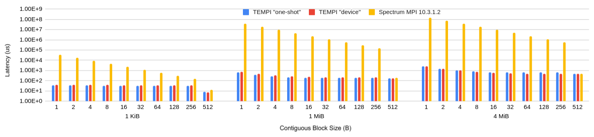
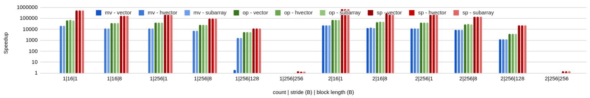

# TEMPI (Topology Experiments for MPI)

tem·pi */ˈtempē/*
- plural form of tempo: the rate of speed or motion of an activity

Experimental performance enhancements for CUDA+MPI codes.

## MPI Derived Type PingPong on OLCF Summit

2D objects



## MPI Pack Speedup

2D objects, vs MVAPICH 2.3.4 (mv), OpenMPI 4.0.5 (op), and Spectrum MPI 10.3.1.2 (sp)



## Quick StartBoost Software License - Version 1.0 - August 17th, 2003

Permission is hereby granted, free of charge, to any person or organization
obtaining a copy of the software and accompanying documentation covered by
this license (the "Software") to use, reproduce, display, distribute,
execute, and transmit the Software, and to prepare derivative works of the
Software, and to permit third-parties to whom the Software is furnished to
do so, all subject to the following:

The copyright notices in the Software and this entire statement, including
the above license grant, this restriction and the following disclaimer,
must be included in all copies of the Software, in whole or in part, and
all derivative works of the Software, unless such copies or derivative
works are solely in the form of machine-executable object code generated by
a source language processor.

THE SOFTWARE IS PROVIDED "AS IS", WITHOUT WARRANTY OF ANY KIND, EXPRESS OR
IMPLIED, INCLUDING BUT NOT LIMITED TO THE WARRANTIES OF MERCHANTABILITY,
FITNESS FOR A PARTICULAR PURPOSE, TITLE AND NON-INFRINGEMENT. IN NO EVENT
SHALL THE COPYRIGHT HOLDERS OR ANYONE DISTRIBUTING THE SOFTWARE BE LIABLE
FOR ANY DAMAGES OR OTHER LIABILITY, WHETHER IN CONTRACT, TORT OR OTHERWISE,
ARISING FROM, OUT OF OR IN CONNECTION WITH THE SOFTWARE OR THE USE OR OTHER
DEALINGS IN THE SOFTWARE.


* Linux
* C++17 (`variant`, `filesystem`, and `optional`)
* nvcc with `-std=c++14`
* CUDA-aware MPI

Please see system-specific advice at the bottom of this file.

```
mkdir build
cd build
cmake ..
make
make test
```

If some tests fail, ensure you are using a CUDA-aware MPI implementation.
`cmake` will print the MPI implementation TEMPI is using.
If you need to find a different MPI:

```
rm CMakeCache.txt
cmake -DCMAKE_PREFIX_PATH=/path/to/mpi ..
```

Add the TEMPI library to your link step before the underlying MPI library.

```
g++ ... -L/dir/containing/libtempi.so -l tempi <other link flags>
```

```cmake
add_subdirectory(tempi)
target_link_libraries(my-exe PRIVATE tempi::tempi)
target_link_libraries(my-exe PRIVATE ${MPI_CXX_LIBRARIES})
```

## Features

Performance fixes for CUDA+MPI code that requires no source code changes
- [x] Fast `MPI_Pack` on strided data types (disable with `TEMPI_NO_PACK`)
  - [x] vector
  - [x] hvector
  - [x] subarray
  - [x] contiguous
- [x] Fast `MPI_Send/MPI_Isend` on strided data types
  - [x] vector
  - [x] hvector
  - [x] subarray
  - [x] contiguous
- [x] node remapping in `MPI_Dist_graph_create`
  - [x] METIS
  - [x] KaHIP
- [x] (OLCF Summit) Fast `MPI_Alltoallv` on basic data types (disable with `TEMPI_NO_ALLTOALLV`)
  - [ ] derived datatypes
- [ ] Fast `MPI_Neighbor_alltoallv` on basic data types
  - [ ] derived datatypes

## References

[TEMPI: An Interposed MPI Library with a Canonical Representation of CUDA-aware Datatypes (preprint)](https://arxiv.org/abs/2012.14363)
```
@misc{pearson2021tempi,
      title={TEMPI: An Interposed MPI Library with a Canonical Representation of CUDA-aware Datatypes}, 
      author={Carl Pearson and Kun Wu and I-Hsin Chung and Jinjun Xiong and Wen-Mei Hwu},
      year={2021},
      eprint={2012.14363},
      archivePrefix={arXiv},
      primaryClass={cs.DC}
}
```
You will probably be most interested in `src/internal/types.cpp`,`src/internal/sender.cpp`

## Binaries

| Path | numprocs | Description |
|-|-|-|
|`bin/measure-system` | 2 | Generate `perf.json` in `TEMPI_CACHE_DIR` |
|`bin/bench-mpi-pack` | 1 |Benchmark `MPI_Pack` and `MPI_Unpack` for a variety of 2d objects |
|`bin/bench-mpi-pingpong-1d` | 2 | Benchmark MPI_Send time for contiguous data using pingpong |
|`bin/bench-mpi-pingpong-nd` | 2 | Benchmark MPI_Send time for 2d data using pingpong |
|`bin/bench-halo-exchange NITERS X Y Z` | 1+ | Benchmark a 3D halo exchange for an XYZ grid |

## Design 

### MPI Implementation

Instead of using the MPI Profiling Interface (PMPI), our functions defer to the next symbol so this library can be chained with libraries that *do* use PMPI.

For example:

```c++
#include <mpi.h>
#include <dlfcn.h>

typedef int (*Func_MPI_Init)(int *argc, char ***argv);
Func_MPI_Init fn = nullptr;

extern "C" int MPI_Init(int *argc, char ***argv)
{
    if (!fn) {
        fn = reinterpret_cast<Func_MPI_Init>(dlsym(RTLD_NEXT, "MPI_Init"));
    }
    return fn(argc, argv);
}
```

instead of 

```c++
#include <mpi.h>

extern "C" int MPI_Init(int *argc, char ***argv)
{
    return PMPI_Init(argc, argv);
}
```

This library should come before any profiling library that uses PMPI in the linker order, otherwise the application will not call these implementations.
As we do not extend the MPI interface, there is no include files to add to your code.

### MPI derived datatype analysis (`src/internal/types.cpp`)

Different MPI derived datatypes can describe the same pattern of bytes to be `MPI_Pack`ed or `MPI_Send`ed.
TEMPI makes an effort to canonicalize those types in order to determine whether optimized GPU routines apply.

* `src/internal/types.cpp`
* `src/type_commit.cpp`

### Device, One-shot, or Staged MPI_Send

TEMPI integrates non-contiguous datatype handling with MPI_Send.
Data can be packed in the GPU and sent directly (`DEVICE`), staged into the CPU and then sent (`STAGED`), or packed directly into the CPU with mapped memory (`ONE_SHOT`).

* `src/internal/packer_1d.cu`
* `src/internal/packer_2d.cu`
* `src/internal/packer_3d.cu`
* `src/internal/sender.cpp`

### Device or One-shot MPI_Isend

MPI_Isend / MPI_Irecv are implemented asynchronously using state machines that are allowed to make progress during other asynchronous calls, and MPI_Wait.

* `src/internal/async_operation.cpp`

### Topology Discovery

Some optimizations rely on knowing which MPI ranks are on the same node.
This is discovered during `MPI_Init` and can be queried quickly during other MPI functions.

* `include/topology.hpp`

### Slab allocator

Some optimizations require reorganizing data into temporary device buffers.
The size of those buffers is not known until runtime.
We use a primitive slab allocator to minimize the number of `cudaMalloc` or `cudaHostRegister`.

* `include/allocator_slab.hpp`
* `src/internal/allocators.hpp`

### Rank Placement

When `MPI_Dist_graph_create_adjacent` is used, and `1` is passed for the `reorder` parameter, TEMPI uses METIS or KaHIP to group heavily-communicating ranks onto nodes.
Internally, each rank is remapped onto one rank of the underlying library, and the substitution is made during all calls that use the communicator.

* `include/topology.hpp`/`src/internal/topology.cpp`
* `src/internal/partition_kahip.cpp`
* `src/internal/partition_metis.cpp`
* `src/internal/partition_kahip_process_mapping.cpp`

### IID System Parameter Measurements

TEMPI supports different implementation based on system properties.
`bin/measure-system` records the profile in `$TEMPI_CACHE_DIR`, and the TEMPI library can use that record.
IID testing is inspired by the SP 800 90B NIST standard.

* `src/internal/types.cpp`
* `src/internal/iid.cpp`

### Performance Counters

At -DTEMPI_OUTPUT_LEVEL=DEBUG or higher, performance counters for each rank are dumped at `MPI_Finalize()`.

* `include/counters.hpp`/`src/internal/counters.cpp`

## Knobs

The system can be controlled by environment variables.
These are the first thing read during `MPI_Init` (even if `TEMPI_DISABLE` is set, of course).
Setting the corresponding variable to any value (even empty) will change behavior.

The behavior of these can be seen in `src/internal/env.cpp`

|Environment Variable|Effect when Set|
|-|-|
|`TEMPI_CACHE_DIR`|Where the system measurement results go `perf.json`. Defaults to `$XDG_CACHE_DIR`, then `$XDG_CACHE_HOME/tempi`, then `$HOME/.tempi`, then `/var/tmp`.|
|`TEMPI_DISABLE`|Disable all TEMPI behavior. All calls will use underlying library directly.|
|`TEMPI_NO_ALLTOALLV`|Use library `MPI_Alltoallv`|
|`TEMPI_NO_PACK`|Use library `MPI_Pack`|
|`TEMPI_NO_TYPE_COMMIT`|Use library `MPI_Type_commit`. Don't analyze MPI types for allowable optimizations.|
|`TEMPI_PLACEMENT_RANDOM`| Do random rank placement for `MPI_Dist_graph_create_adjacent`|
|`TEMPI_PLACEMENT_METIS` | Do rank placement using METIS for `MPI_Dist_graph_create_adjacent`|
|`TEMPI_PLACEMENT_KAHIP` | Do rank placement using KaHIP for `MPI_Dist_graph_create_adjacent`|
|`TEMPI_DATATYPE_ONESHOT`| Pack noncontiguous datatypes into pinned CPU memory before Send/Isend |
|`TEMPI_DATATYPE_DEVICE` | Pack noncontiguous datatypes into GPU memory before Send/Isend |
|`TEMPI_DATATYPE_AUTO` |Use results of `bin/measure-system` to select between `DEVICE` and `ONESHOT`|
|`TEMPI_CONTIGUOUS_STAGED` | Copy data to CPU, then send |
|`TEMPI_CONTIGUOUS_AUTO` |Use results of `bin/measure-system` to enable `STAGED` for some transfer sizes|

to unset an environment variable in bash: `unset <VAR>`

## FAQ

* I see something like `WARN[...]{...} clamp x in 2d interpolation`

This means that one of the message parameters (size, etc.) is outside of the measured range for teh system, causing interpolation in performance modeling to fail.

* I see something like `INFO[...]{...} couldn't open path/to/perf.json`.

This means that TEMPI cannot find the perf.json file generated by `bin/measure-system` in the expected location.
Ensure `TEMPI_CACHE_DIR` is set to a writeable location, and re-run `bin/measure-system` with 2 ranks.

* I see something like `ERROR[...]{...} there were ... managed async operations unterminated at finalize`

This probably means that your program crashed with active asynchronous operations, or is not `MPI_Waiting` for all operations it starts.

* I see something like `FATAL[...]{...} Tried to free memory not from this allocator. Please report this.`

This is an internal TEMPI error, and should be reported. In the mean time, see the [knobs](#knobs) to disable the optimization in question.

## OLCF Summit

```
module unload darshan-runtime
module load gcc/9.0.3 cuda/11.0.3
```

Summit wants to find MPI_Init in darshan (`jsrun -E LD_DEBUG=symbols`).

```
symbol=MPI_Init;  lookup in file=bin/bench-mpi-pack [0]
     68381:     symbol=MPI_Init;  lookup in file=/autofs/nccs-svm1_sw/summit/.swci/1-compute/opt/spack/20180914/linux-rhel7-ppc64le/gcc-4.8.5/darshan-runtime-3.1.7-cnvxicgf5j4ap64qi6v5gxp67hmrjz43/lib/libdarshan.so [0]
```

Darshan is not explicitly included in the link step when building, so somehow it is injected at runtime.
In any case, we can fix this by `module unload darshan-runtime`, so then our `MPI_Init` happens right after `libpami_cudahook.so`.
Later, the lazy lookup will cause it to happen in `libmpiprofilesupport.so.3` and then `libmpi_ibm.so.3`.

We need gcc 9.3 for filesystem and variant support.
Cuda 11.0.3 (11.0.221) is new enough to use gcc 9.3, but newer versions of cuda have a memory leak when used with spectrum mpi.


nsight-systems 2020.3.1.71 can crash with the osrt or mpi profiler turned on.
 Disable with `nsys profile -t cuda,nvtx`.

To control the compute mode, use bsub -alloc_flags gpudefault (see `olcf.ornl.gov/for-users/system-user-guides/summitdev-quickstart-guide/#gpu-specific-jobs`)

To enable GPUDirect, do `jsrun --smpiargs="-gpu" ...` (see docs.olcf.ornl.gov/systems/summit_user_guide.html, "CUDA-Aware MPI")

## NCSA Hal

We require cmake 3.18, so you have to **install it yourself** and then get it into your path. you may have to  `module unload cmake` to get the HAL cmake out of your path.

We require at least some C++17 support for `src/internal/types.cpp` and `include/types.hpp`.
Therefore, we need

`module load at/12.0`

This causes some ieee float128 errors, so we also need

`export CUDAFLAGS=-Xcompiler=-mno-float128`

before `cmake ..`

## OpenMPI

OpenMPI can be built with CUDA support:

`./configure --prefix=<> --with-cuda=/usr/local/cuda && make && make install`

## mvapich2-gdr 2.3.5

Seems to integrate some recent work, but also may rely on Mellanox OFED.

Download one of the recent debs.
Older ones will want older gfortran libraries and things that might be hard.

http://mvapich.cse.ohio-state.edu/download/mvapich/gdr/2.3.5/mofed5.0/mvapich2-gdr-mcast.cuda11.0.mofed5.0.gnu9.3.0-2.3.5-1.el7.x86_64.rpm

`rpm2cpio mvapich... | cpio -id`

Then modify the paths in lib64/pkgconfig, mpicc, and mpic++ scripts with the actual install location and CUDA paths.

## Contributing

* Underlying MPI functions are declared in `include/symbols.hpp` and discovered in `src/internal/symbols.cpp`. Any MPI functions that will be overridden should be added there.
* The new implementations are defined in `src/*.cpp`, in a file of the same name as the function without the `MPI_` prefix.
* Most of the internal heavy lifting is done by `include/` and `src/internal`. Reusable parts of the implementation should happen there.
  * Reading environment variable configuration is in `include/env.hpp` and `src/internal/env.cpp`.
* Support code for benchmarking and testing is in `support/`. This code should only be used in test and benchmarking binaries, never in the implementation.
* Testing code is in `test/`

## License

Boost software license 1.0
Please see the `LICENSE` file.

* [`thirdparty/martinmoene/optional.hpp`](https://github.com/martinmoene/optional-lite) is also licensed under the Boost Software License 1.0. Thanks to Martin for making that project available.

* [KaHIP](https://github.com/KaHIP/KaHIP) is distributed under the MIT license.
